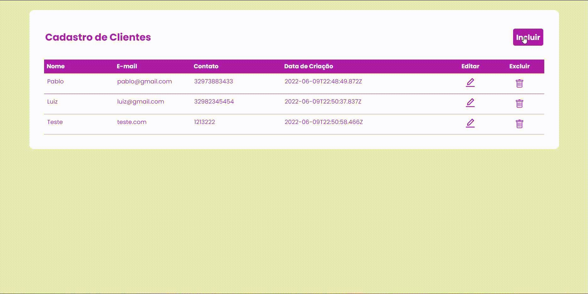

# Locker It Crud Client

 

  
  

## Sobre o projeto

Locker It é um protótipo de uma aplicação destinada a empresas de reservas de divisórias de guarda-volumes. 

##### *Com ela:* 
+ O cliente poderá verificar a disponibilidade de uma divisória vaga e fazer a reserva. 
+ O cliente poderá acompanhar a sua reserva e o tempo disponível em tempo real.
+ O cliente será notificado quando o tempo da reserva estiver acabando e poderá estender a sua reserva.

## 🔻 Requisitos

+ Ter o <a href="https://nodejs.org/en/">*Node.js*<a/> instalado.
+ Ter o <a href="https://www.postgresql.org/download/">*Postgres*<a/> instalado.
+ Ajustar o endereçamento da rede IP para prover acesso entre o servidor NodeJS e o Postgres Server e as informações referentes a sua base de dados.

## 💻  Tecnologias utilizadas

+ Linguagens: *JavaScript, Typescript, HTML* e *CSS*
+ Framework: *React.js* e *Express.js*
+ ORM: *TypeORM*
+ Database: *PostgreSQL*

## 💾 Instrução de criação do Banco de Dados

`CREATE DATABASE locker-it;`

## ▶   Rodando o Projeto

### Client

  1. `$ cd Client `
  2. `$ npm install` or `$ yarn install`
  3. `$ npm start` or `$ yarn start`

### Server

  1. Troque os dados referentes ao seu banco de dados em `src/server/database/data_source.ts`
  2. `$ cd Server `
  3. `$ npm install` or `$ yarn install`
  4. `$ npm dev` or `$ yarn dev`
  
## Bibliotecas usadas

### Front-end

 + `@material-ui`
 +  `Axios`

### Back-end

+ `express`
+ `typescript`
+ `pg`
+ `ts-node-dev`
+ `typeorm`
+ `uuid`
+ `cors`

## Autor

#### Pablo Marcos Barbosa Souza

+ *Linkedin:* https://www.linkedin.com/in/pbarsou/
